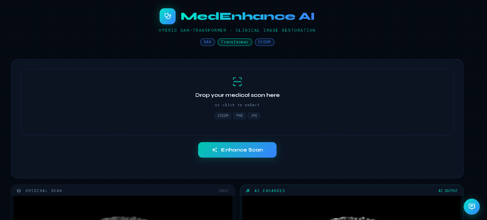
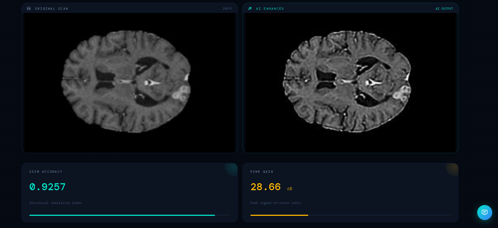
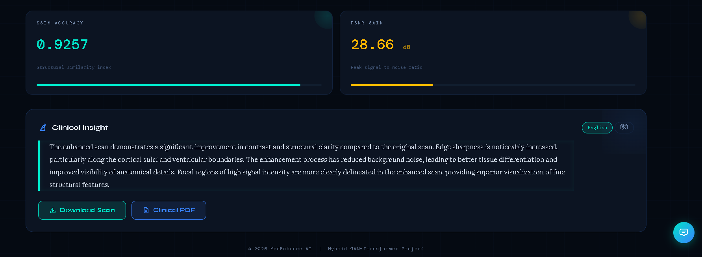
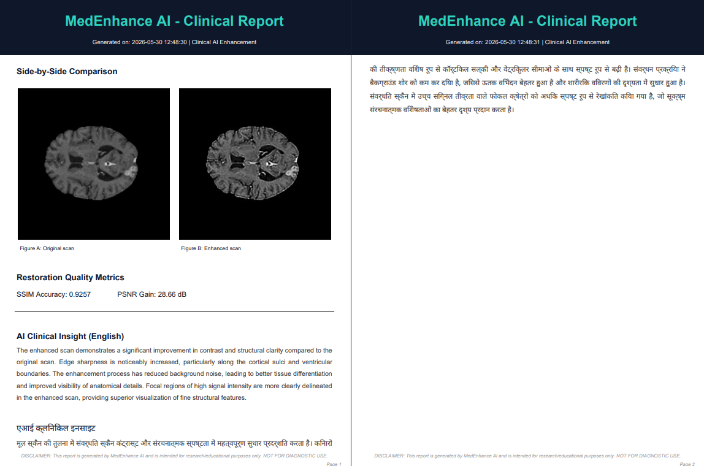

# 🩺 MedEnhance AI

> **Hybrid GAN–Transformer Clinical Image Restoration**  
> Upload a medical scan → Get an AI-enhanced version with clinical insights, quality metrics, and a downloadable PDF report.


---

## ✨ Features

- 🔬 **AI Image Enhancement** — Hybrid GAN–Transformer model restores and enhances medical scans
- 📊 **Quality Metrics** — Real-time SSIM accuracy and PSNR gain scores
- 🧠 **Clinical Insight** — Gemini-powered AI generates a professional enhancement-focused report
- 🌐 **Bilingual Reports** — Clinical insights in both English and Hindi
- 💬 **Interactive Chat** — Ask questions about your scan via the built-in clinical assistant
- 📄 **PDF Export** — Download a formatted clinical report with scan comparison
- 🖼️ **Multi-format Support** — Accepts DICOM, PNG, and JPG inputs
- 🔒 **Safe Filenames** — All uploads anonymised with UUID-based naming

---

## 📸 Screenshots

| Upload & Enhance | Scan Comparison |
|---|---|
|  |  |

| Metrics & Report | Clinical PDF |
|---|---|
|  |  |

---

## 🗂️ Project Structure

```
medical_image_enhancement_flask/
│
├── app.py                        # Flask application — routes & logic
├── requirements.txt              # Python dependencies
├── .env                          # API keys (not committed)
│
├── model/
│   ├── hybrid_model.py           # GAN–Transformer architecture
│   └── hybrid_best.pth           # Trained model weights
│
├── utils/
│   ├── preprocess.py             # Image preprocessing pipeline
│   ├── postprocess.py            # Model output post-processing
│   ├── metrics.py                # SSIM & PSNR calculation
│   ├── llm_analysis.py           # Gemini API — report & chat
│   └── report_generator.py       # Clinical PDF generation
│
├── templates/
│   └── index.html                # Main Jinja2 template
│
└── static/
    ├── style.css                 # UI styles
    ├── uploads/                  # Uploaded scans (auto-generated, not committed)
    ├── outputs/                  # Enhanced scans (auto-generated, not committed)
    └── screenshots/              # README screenshots
```

---

## ⚙️ Setup & Installation

### 1. Clone the repository
```bash
git clone https://github.com/p-singhal-0011/MedEnhanceAI.git
cd MedEnhanceAI
```

### 2. Create a virtual environment
```bash
python -m venv venv

# Windows
venv\Scripts\activate

# macOS / Linux
source venv/bin/activate
```

### 3. Install dependencies
```bash
pip install -r requirements.txt
```

### 4. Configure environment variables

Create a `.env` file in the root directory:
```env
GEMINI_API_KEY=your_gemini_api_key_here
```

> Get your free Gemini API key at [https://aistudio.google.com](https://aistudio.google.com)

### 5. Add model weights

Place your trained model file at:
```
model/hybrid_best.pth
```

### 6. Run the application
```bash
python app.py
```

Open your browser at `http://127.0.0.1:5000`

---

## 🔌 API Endpoints

| Method | Endpoint | Description |
|---|---|---|
| `GET` | `/` | Main application page |
| `POST` | `/` | Upload scan & run enhancement |
| `POST` | `/chat` | Chat with clinical assistant |
| `GET` | `/download-report` | Download clinical PDF |

---

## 🧠 How It Works

```
User uploads scan (PNG / JPG / DICOM)
        ↓
Filename anonymised with UUID + timestamp
        ↓
GAN–Transformer model enhances the image
        ↓
SSIM & PSNR metrics calculated
        ↓
Gemini Vision API analyses both scans
        ↓
Bilingual clinical report generated (EN + HI)
        ↓
Results displayed + PDF export available
        ↓
Chat assistant available for enhancement questions
```

---

## 🤖 AI Prompts

The app uses **two separate Gemini prompts**:

| Prompt | Used For | Output |
|---|---|---|
| Report Prompt | After enhancement — generates the clinical insight card | `{"en": "...", "hi": "..."}` JSON |
| Chat Prompt | `/chat` endpoint — answers user questions about the scans | Plain text response |

Both prompts are strictly scoped to **image enhancement quality only** and will not provide medical diagnoses or treatment recommendations.

---

## 📦 Requirements

```
flask
python-dotenv
google-generativeai
Pillow
numpy
scikit-image
fpdf2
torch
torchvision
```

> Full list in `requirements.txt`

---

## 🔒 File Naming & Privacy

All uploaded files are immediately renamed using a UUID-based scheme:

```
# Original filename (never stored or exposed)
brain_mri_scan.jpeg

# Stored as
input_3f8a1c2b_20260530_141022.jpeg
enhanced_3f8a1c2b_20260530_141022.jpeg
```

This ensures no personal metadata appears in URLs, logs, or PDF reports.

---

## ⚠️ Gemini API — Free Tier Limits

| Model | Requests/Day | Recommended |
|---|---|---|
| `gemini-2.0-flash` | 200 | ✅ Best for free tier |
| `gemini-1.5-flash` | 1,500 | ✅ Highest free limit |
| `gemini-3-flash` | 20 | ⚠️ Hits limit quickly |

> If you see `429 ResourceExhausted`, you've hit the daily quota. Switch to `gemini-2.0-flash` or `gemini-1.5-flash` in `llm_analysis.py`.

---

## ⚠️ Disclaimer

> This application is built for **research and educational purposes only**.  
> It is **NOT intended for clinical diagnosis or medical decision-making**.  
> Always consult a qualified radiologist or healthcare professional for medical interpretation.

---

## 🛠️ Built With

| Technology | Purpose |
|---|---|
| [Flask](https://flask.palletsprojects.com/) | Web framework |
| [PyTorch](https://pytorch.org/) | GAN–Transformer model |
| [Google Gemini](https://ai.google.dev/) | Clinical report & chat AI |
| [scikit-image](https://scikit-image.org/) | SSIM / PSNR metrics |
| [FPDF2](https://py-fpdf2.readthedocs.io/) | PDF report generation |
| [Tabler Icons](https://tabler-icons.io/) | UI icons |
| [Syne + DM Mono + Lora](https://fonts.google.com/) | Typography |

---

## 📄 License

This project is licensed under the MIT License — see the [LICENSE](LICENSE) file for details.

---

## 🙋‍♂️ Author

**Priyansh Singhal**  
[](https://github.com/p-singhal-0011)

---

<p align="center">© 2026 MedEnhance AI | Hybrid GAN–Transformer Project</p>
